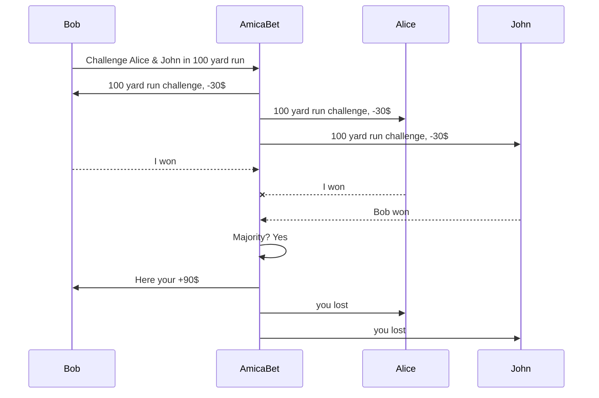
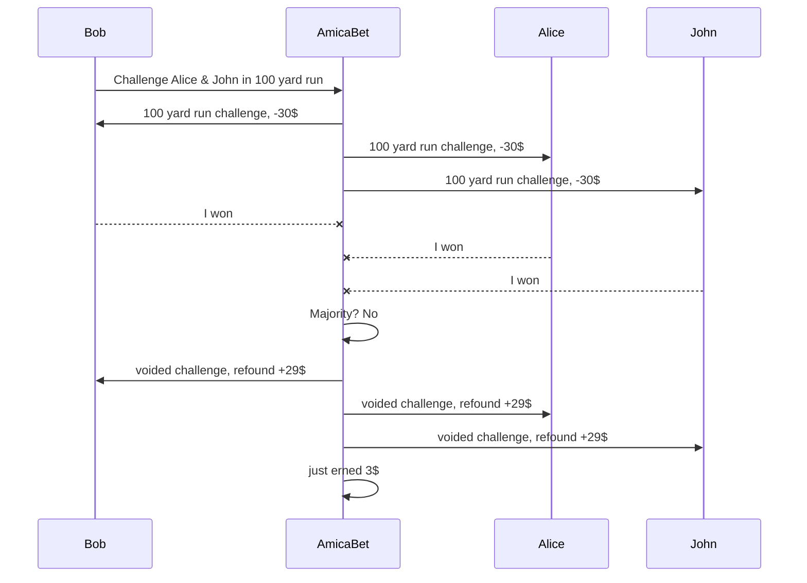

# AmicaBet

### Table of contents

1. [Project Description](#Project-Description)
    1. [How does it work](#how-does-it-work)
    2. [Tokens (Wager)](#tokens-wager)
    3. [How are custom bets settled?](#how-are-custom-bets-settled)
        1. [Sample diagram of a non-voided game](#sample-diagram-of-a-non-voided-game)
        2. [Sample diagram of a voided game](#sample-diagram-of-a-voided-game)
2. [Technical Documentation](#technical-documentation)
    1. [Tech Stack](#tech-stack)
    2. [Software Architecture](#software-architecture)
3. [Features](#fetures) 1.[Registration / Login](#registration--login) 1.[Database](#database) 1.[User Interaction](#user-interaction) 1.[Bets](#bets) 1.[Deployment](#deployment) 1.[Others](#others)
4. [Run AmicaBet locally](#run-amicabet-locally)

# Project Description

**AmicaBet** is a betting social network built with Flask. It allows users to bet on custom bets. **What does it mean?** AmicaBet lets you bet on anything. It does not matter if it is your golf game over the weekend or who can run a faster mile. Basically, any bet you create is a custome bet, which requires the following informations:

-   Event Title: (e.g. Golf Game, Fastest mile run )
-   Description: optional (e.g. ["How about you accept the challenge so we can see who's better at golf?"])
-   Bettors: (list of one or more friends to challenge)
-   Wager: (The number of tokens all bettors have to pay to accept the bet)

Once the bet is created, the app will automatically send a request to all friends involved, allowing them to accept or reject the challenge. If no one gets it, the bet is closed with no winner. The challenge begins if a chance is taken and there are at least two bettors. The app will automatically detract the wager from the user's balance.

## How does it work?

#### 1. Pick the bet

Bet on anything - football match, election, the weather, or **whatever you can think of**.

#### 2. Pick your friends

Connect with friends who enjoy having a bet.

#### 3. Pick the wager

How much are you both going to put on the line?

## Tokens (Wager)

The balance is expressed in tokens, a digital currency that all users can buy from the website's store.
**Why tokens and not just USD?** Tokens are free of charge to move around. Any time a bet is placed, tokens are exchanged from all bettors to the pool. Once a winner is chosen, the pool will be founded to the winner's balance. It's just easier.

## How are custom bets settled?

As the introductory paragraph explains, custom bets are settled through mutual agreement between opponents. Both sides must agree to the outcome or a small percentage is detracted from the pool, meaning the bet is voided. A <u>voided game is when a mutual agreement between users is not reached.</u> Therefore, someone has lied about the votes. The goal is to incentive people to be honest with their bets and for people who are open to betting only with other honest people. To do so, **AmicaBet** will collect user data, calculate a percentage of non-voided games' overall games, and display it under the user's profile.

### Sample diagram of a non-voided game

### Sample diagram of a voided game

# Technical Documentation

What building techs **AmicaBet** uses? This paragraph discusses what techs are used to build the webapp and what reason they have been chosen.

## Tech Stack

The full development stack is:

1.  **Flask**, a web framework that uses python as core to manage HTTP requests and Database to create dynamic web pages
2.  **Bootstrap 5** to style web pages in a simple and quick manner
3.  **SQLite3** is a Python SQL toolkit and Object Relational Mapper that gives application developers the full power and flexibility of SQL
4.  more ...

## Software Architecture

.png>)

# Features

AmicaBet is currently under development. Some features have already been implemented, while others are still in progress. Below is a comprehensive list of completed ✅ and pending features:

## Registration / Login

-   [x] Responsive UI
-   [x] Register Users
-   [x] Login Users
-   [x] Security: Server checks if inputs _[email, password, ...]_ are valid
-   [x] Code refactoring for improvement

## Database

-   [x] SQLite Integration
-   [x] Database Normalization
-   [x] Switching to MySql Database
-   [x] Code refactoring for improvement

## User Interaction

-   [ ] Responsive UI
-   [x] Friend request to other users
-   [x] Accept/Reject incoming requests
-   [x] Search Users by name
-   [x] Challenge a friend in bets
-   [x] Accept/Reject bets
-   [x] Vote winner during bet
-   [x] Push notification when receiving a friend request
-   [x] Friends can see your bets
-   [x] Friends can request to join bets
-   [x] Data analytics
-   [x] Code refactoring for improvement
-   [x] Purches Tokens

## Bets

-   [x] Sort bets by current state _[accepted, rejiected, voided, won, lost]_
-   [x] Voting in bet
-   [x] Mutual Agreement algorithm [decides the winer]
-   [ ] Schedule a deadline for the bet
-   [x] push notifications when receiving a bet request
-   [x] Code refactoring for improvement

## Deployment

-   [x] Docker file
-   [x] kubernetes file
-   [x] Google Cloud Deployment
-   [x] Different Deployment [Eventually for cheaper solution]

## Others

-   [ ] Software Engineering Documentation

Certainly, here are five sample rows of data for the "Bet" table:

| Bid | Title          | Description                | Wager | Pool | Status  |
| --- | -------------- | -------------------------- | ----- | ---- | ------- |
| 1   | Football Match | Predict the winner         | 3     | 6    | Running |
| 2   | Horse Race     | Bet on the fastest horse   | 4     | 8    | Closed  |
| 3   | Basketball     | Total points over/under    | 4     | 4    | Pending |
| 4   | Poker Night    | Place your poker hand bet  | 5     | 10   | Running |
| 5   | Tennis Match   | Predict the set outcomes   | 2     | 4    | Closed  |
| 6   | Cricket Match  | Guess the winning margin   | 3     | 6    | Running |
| 7   | Slot Machine   | Spin for a chance to win   | 10    | 20   | Closed  |
| 8   | Soccer Penalty | Predict the shooter's side | 10    | 10   | Pending |

Remember that these examples are fabricated for demonstration purposes and may not reflect real-world data accurately.

# Run AmicaBet locally

Follow the steps to

## Activate environment

`. venv/bin/activate` or windows `venv\Scripts\activate`

## Install requirements

`pip install -e .`

## List the installed items

`pip list`

## Run

first you need to initialize the database. Like so:

`flask --app server init-db`

then ...

`flask --app server run --host localhost --debug`
`flask --app amica run --port 5001 --debug`
