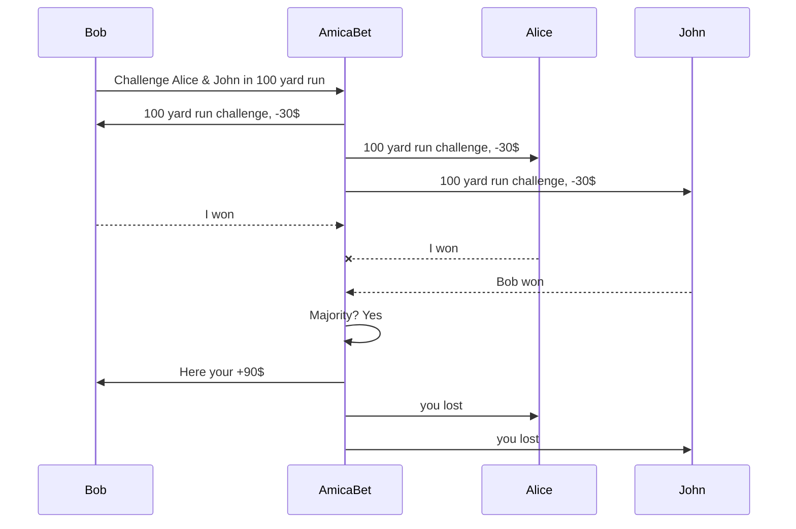
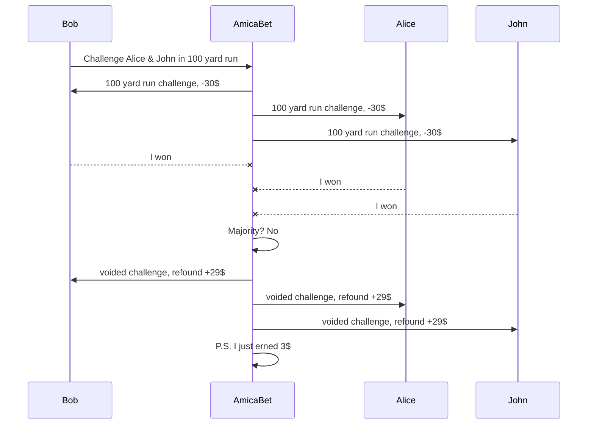
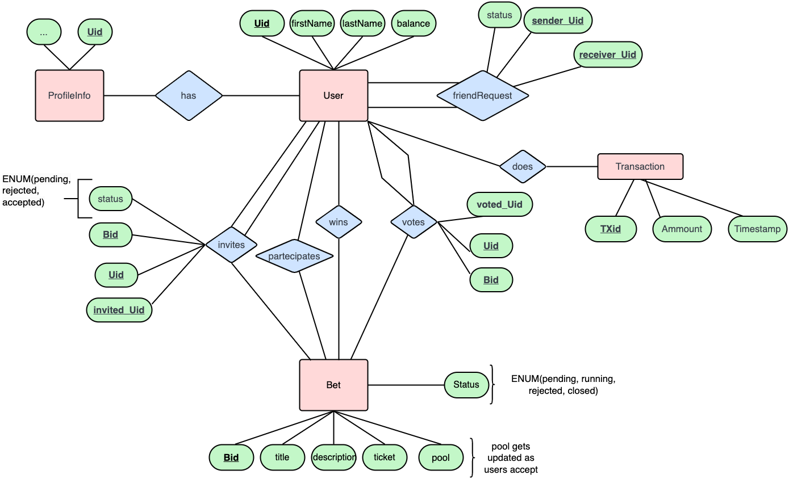

# AmicaBet Docs

**AmicaBet** is a betting social network built with Flask. It allows users to bet on anything they want. Therefore, they can create custom bets, and invite friends to accept their challenges. **AmicaBet** lets you create a custom bet with the following info:

-   **Event** _(e.g. ["Arm wrestling" , "100 yard sprint"] )_
-   **Description** optional _(e.g. ["how about you accept the challenge so we can see who's better at arm wrestling"])_
-   **Bettors** _(list of one or more friends to challenge)_
-   **Ticket's price** _(The amount of tokens all bettors have to pay in order to accept the bet)_

Once the bet has been created the app will automatically send a request to all friends involved into a bet, where they can choose to accept or reject the challenge. If no one accepts it then, the bet is closed with no winner. If a bet is accepted and there are at least 2 bettors the challenge begins. The app will automatically detract the ticket price from user's balance.
**Tokens**
The **balance** is expressed in **tokens**, a digital currency that all users can buy from the website's store. _(Possibly there is a chance that the app runs promotions. E.g. 1$ = 1 token. If you buy 100$ of tokens then you get 5 for free)_. When a user has accumulated enough token _(100 tokens)_ he can withdraw the amount in USD. The user can use the promotions only once in a while (otherwise we have infinite glitch money).
**Why tokens and not just USD?** Tokens are free of charge to move around. Any time a bet is placed, there are transaction of tokens from all bettors to the pool. Once a winner is chosen the pool will be founded to the winner's balance. It's just easier.
**How is a winner chosen?** **AmicaBet** lets the bettors choose the winner, but it will listen to the <u>majority of the votes to determine the winner</u>. If there is no majority the bet is **voided**. In a **voided** bet the bettors are refunded only of a percentage of the original ticket's price. This to incentive users to be honest or they'll slowly loose balance.
Additionally **AmicaBet** creates posts and updates the graph of friends about the challenges a user is creating. If a challenge is still available a friend can request to join. All users can challenge all friends and anyone can decided to join after requesting the creator of the bet.

## Core functionality: voided vs non-voided games

As explained before in the introductory paragraph a <u>voided game is a game where consensus was not reached.</u> Therefore someone has lied about the votes. The goal is to incentive people to be honest with their bets, and for people who are honest to bet only with other honest people. To do so **AmicaBet** will collect data about users and will calculate a percentage of non-voided games over all games and display it under user's profile.

### Sample diagram of a non-voided game

### Sample diagram of a voided game

# Technical Documentation

What building techs **AmicaBet** uses? This paragraph discusses what techs are used to build the webapp and what reason they have been chosen.

## Tech Stack

The full development stack is:

1.  **Flask**, a web framework that uses python as core to manage HTTP requests and Database to create dynamic web pages
2.  **Tailwind CSS** to style web pages in a simple and quick manner
3.  **SQLAlchemy** is a Python SQL toolkit and Object Relational Mapper that gives application developers the full power and flexibility of SQL
4.  more ...

## Entity Relationship Diagram

**ER Diagram** stands for Entity Relationship Diagram, also known as ERD is a diagram that displays the relationship of entity sets stored in a database. In other words, ER diagrams help to explain the logical structure of databases. ER diagrams are created based on three basic concepts: entities, attributes and relationships.

### AmicaBet's ER Diagram

#### {v1.1}

